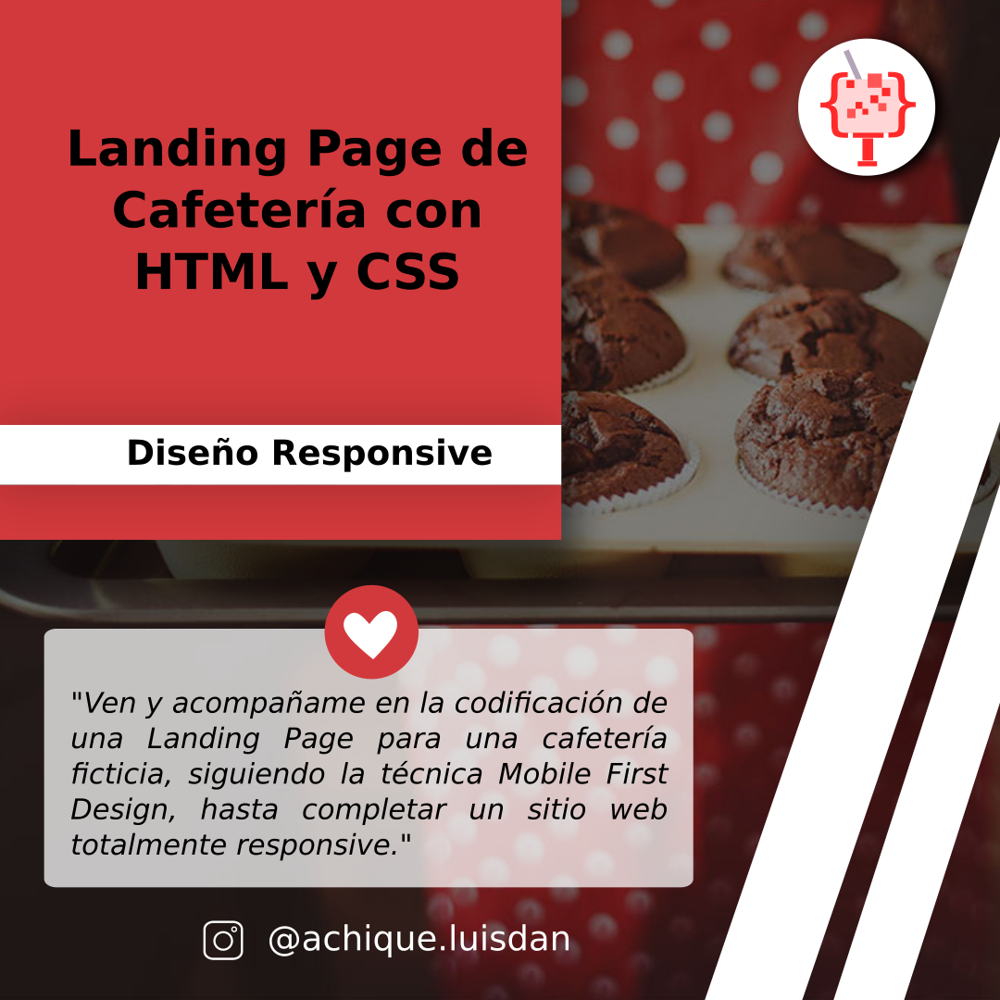
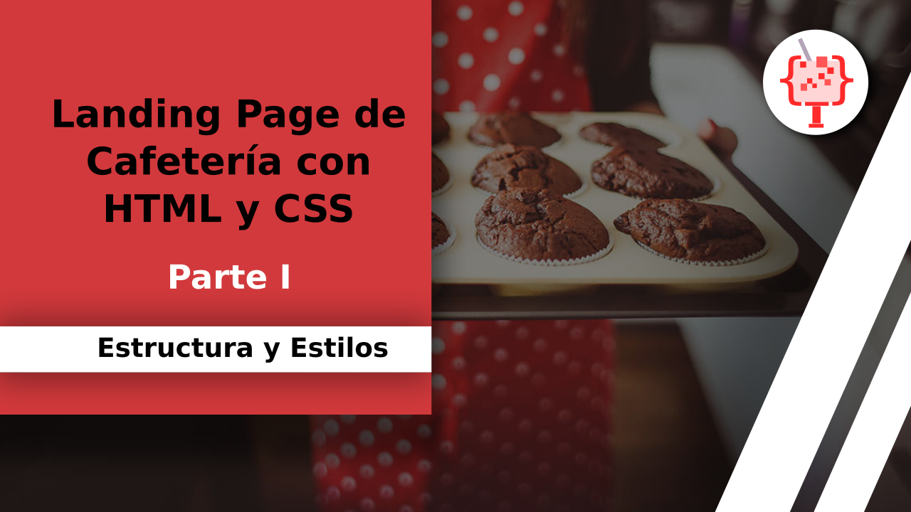

# Web Coffee Domestika



Landing Page para una cafetería ficticia llamada "Café Oslo", presentada como proyecto final del **Curso de Introducción al Desarrollo Web Responsive con HTML y CSS** en la plataforma de Domestika. 

Agradezco al profesor por las imágenes que nos dio con los diseños UI/UX para dispositivos mobiles y desktop. 

Adicionalmente, como parte de mi aporte personal agregué un backend para procesar el formulario de contacto.

## YouTube Coding

Con mucho cariño he grabado estos vídeos para que puedas visualizar el proceso de codificación:

<a href="https://www.youtube.com/watch?v=AL1johGs9EA">
  
  <br>
 Parte 1 . Estructura y Estilos
</a>

## Características ❤️

1. Landing Page con frases de interés. 
2. Formulario de contacto. 
 
## Herramientas 🛠️

### Frontend

* HTML v5
* CSS v3
* Skeleton v2.0.4
* JavaScript  (EmacScript 6)
* Fetch.js

### Backend

* Node.js v16
* Express.js v4.17.1
* typescript v4.4.4
* SQLite3 v5.0.2
* TypeORM v0.2.40
* CORS v2.8.5

### Instalación 🔧

A continuación se indican los pasos para realizar la instalación de las herramientas necesarias para la ejecución del backend:

#### Paso 1. Instalar Node.js

Para ello puedes acceder al sitio oficial de Node.js y descargar el instalador.

#### Paso 2. Instalar dependencias del proyecto

Accede a la carpeta del proyecto en el directorio raíz ejecuta el siguiente comando:

```
npm install
```

#### Paso 3. Compilar proyecto

```
npm run build
```

#### Paso 4. Levantar Servidor

```
npm run start
```

## Mejora Continua 🚀

1. Enviar PDF con el catálogo de productos a los usuarios de contactos interesados.
2. Agregar panel para leer los mensajes de contacto.
3. Agregar inicio de sesión para el administrador de la web. 
4. Ubicar cafetería en Google Maps.
5. Desplegar el backend en un servidor gratuito.
